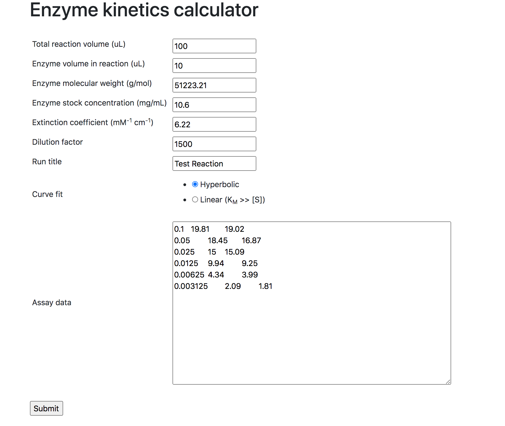

# Michaelis-Menten Flask Calculator

Determine  (turnover number measuring the rate of the enzyme) and  (Michaelis constant measuring subtrate binding affinity) from enzyme activity assay. 
Performs hyperbolic curve fitting with  (initial velocity data) at varying substrate concentrations to the Michaelis-Menten equation.  


When , we utilize the simplified form of the the Michaelis-Menten equation and solve for  (catalytic efficiency) instead of   and  separately.


## Installation
```
git clone https://github.com/eking2/enz_kinetics_flask.git
cd enz_kinetics_flask
pipenv shell
pipenv install
python app.py
```

## Example

### Input

Enter the listed reaction parameters. 
The slopes are entered as space delimited format with the first column as substrate concentrations in mM. 
The next columns are the absorbance slopes in mAbs/min, this can be directly copied from Excel. 
A set of toy data is provided in the `test_input` folder. 
Single trial or multiple trials can be fit at once as long as the trials are separated into different columns.



### Output

The output is a Michaelis-Menten plot with the calculated kinetic parameters. The complete raw input and output data can be downloaded from the link. 


